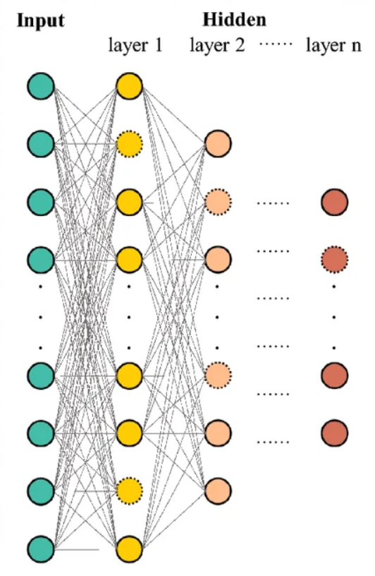
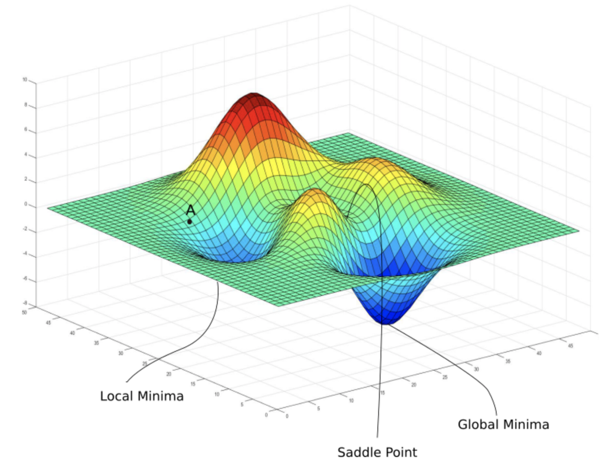

## Foundational Information

### Machine Learning

#### The Process

:::{.columns}
:::{.column width = "70%"}
* Automatic Differentiation (AD) is an essential component to Deep learning (DL), which is a subset to Machine Learning (ML)
  * ML struggles with predicting non-linear functions where DL excels due to it's Neural Networks (NN)
    * To strengthen the connection of neurons between each layer, progressive alterations are made to the model's weights and biases
    * With each layer having differing number of epoch's (time's running through a full dataset), starting weights and biases, each layer offers different gradient values

#### What are Gradients?

* To find the best weights and biases, we combine both into one vector called **w** and evaluate it alongside an error/loss function **E(w)**
* The change of the error function (**the gradient**) shows us which direction would increase or decrease the error the most
:::
:::{.column width = "30%"}

:::
:::

:::{.columns}
:::{.column width = "30%"}
* To reduce the error, we move in the opposite direction of the gradient during training. The goal is to get as close to zero as possible, which is enabled through gradient decent
* **Differentiation** is a method that more efficiently computes gradient functions. Training and model creation becomes easier, simpler, and quicker then other "manual" options. 
:::
:::{.column width = "70%"}

:::
:::


__________________________________________________________________________

## Types of Differentiations


*Important Note:* Differentiation methods are used to compute derivatives of complex functions. It could be utilized in situations not necessarily related to deep learning. This could include engineering design optimization, scientific/statistical parameter estimation, sensitivity analysis, and so forth. Neural Networks did not invent AD, but it's essentially unavoidable when dealing with optimization. 

**Symbolic:** We take a given function, and continously compute it's derivative. In this sense, we are quite literally computing the slope E(w).This method is "strenuous" and becomes increasingly unsavory the more complicated the function becomes. 

**Numeric:** Instead of finding the direct derivative as the symbolic method, we use the follow definition of derivatives: $f^1(x) = f(x + h) - f(x)/h$. This method is fairly straightforward, but once $h$ gets very large or small, the derivative becomes more susceptible truncation errors.

**Automatic:** This is essentially a combination of the last two. This time we use the chain rule, which states that $dy/dx = dy/du * du/x$

* $dy/dx$ -> the overall derivative we are trying to find
* $dy/du$ -> derivative of y with repsect to an intermediate variable
* $du/dx$ -> the derivative of the intermediate variable with repsect to x


## Directional Differentiation

### Forward Mode

* The method is best when dealing with few inputs and many outputs. 
* Computes direction derivatives by obtaining the dot product of the jacobian-vector with x (or any inter-layer in the model)

Compute the forward pass

* $z_0 = W$
* $z_1 = xW$
* $z_2 = z_1 + b$
* $z_3 = \phi(z_2)$
* $z_4 = y - z_3$
* $z_5 = z_4^2$

### Backward Mode

* Computes the gradients starting from the output and then applying the chain rule until it traverses the whole graph
* Best used for many input sna dfew outputs; oppoiste of the forward pass
  * This is typical for most neural networks, so this method is used more widely

Compute the backward pass

* $\frac{d}{dz_4}z_5 = 2z_4$
* $\frac{d}{dz_3}z_4 = -1$
* $\frac{d}{dz_2}z_3 = \phi'(z_2)$
* $\frac{d}{dz_1}z_2 = 1$
* $\frac{d}{dz_0}z_1 = x$

### Example

```python
# init parameter at 0.1
u = 0.1 * torch.ones(1)

# enable gradient tracking (means we will compute derivatives of this parameter)
u.requires_grad_()

# loop 1000 times
for _ in range(1000):

  # forward pass: evaluate the function
  eval = func(u)

  # backward pass: compute derivatives
  eval.backward()

  # update parameter
  u.data = u.data - 1e-1 * u.grad

  # clear out gradients (pytorch automatically accumulates gradients each iter)
  u.grad.zero_()
  # print(u.grad)
```

## AutoDiff's Impact on Deep Learning

* Allows for the training of complex models with non-linear patterns/associations
* Can compute higher-order derivatives, which can lead to better optimization 
* Millions/billions of paramaters can be used for training deep networks 
* No need to manually compute sophisticate gredients; reduces computational time 


## Additional Readings

[Deep Learning by Dave Bergmann](https://www.ibm.com/think/topics/deep-learning)

[Understanding Gradients in Deep Learning by Ayush Dhanker](https://medium.com/@ayush.dhanker/understanding-gradients-in-deep-learning-893cd0563b9a)

[Difference between a Neural Network and a Deep Learning System by GeeksforGeeks](https://www.geeksforgeeks.org/deep-learning/difference-between-a-neural-network-and-a-deep-learning-system/)

[Automatic Differentiation (AutoDiff): A Brief Intro with Examples by Ebrahim Pichka](https://towardsdatascience.com/automatic-differentiation-autodiff-a-brief-intro-with-examples-3f3d257ffe3b/)

[Automatic differentiation in TensorFlow by GeeksforGeeks](https://www.geeksforgeeks.org/deep-learning/automatic-differentiation-in-tensorflow/)