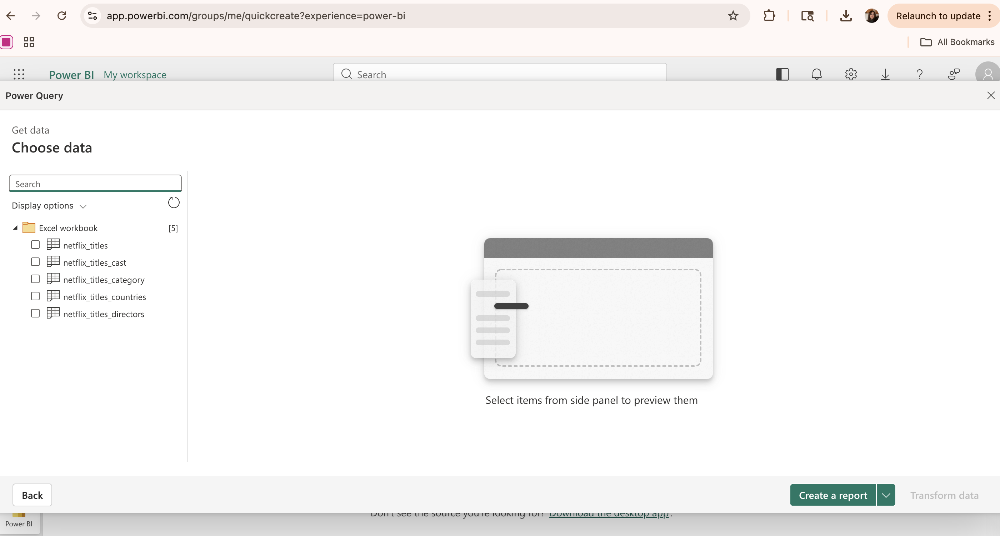
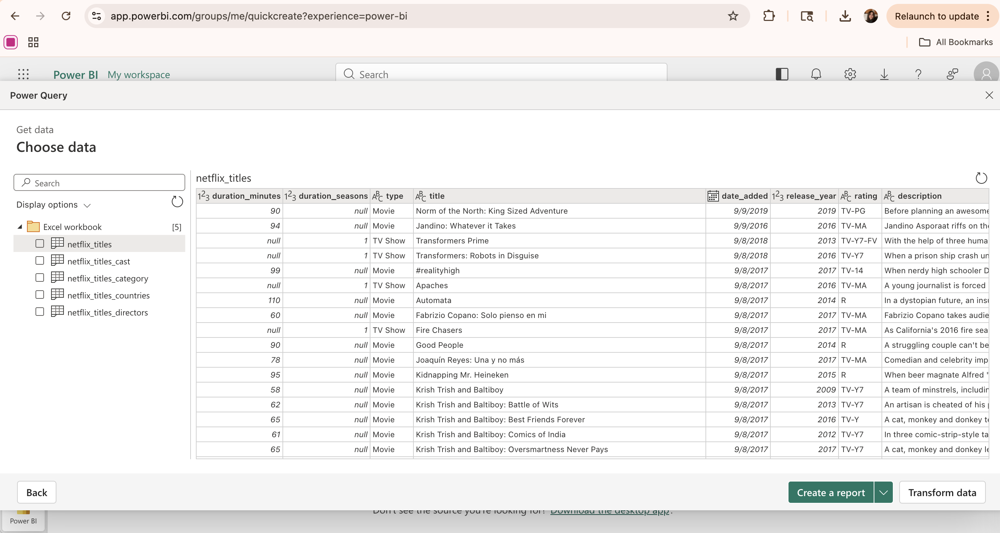
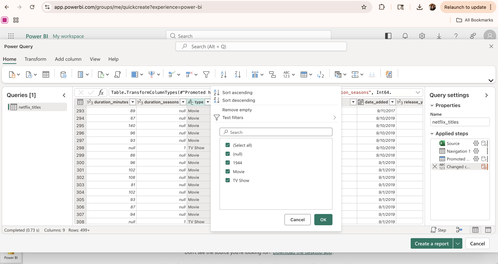
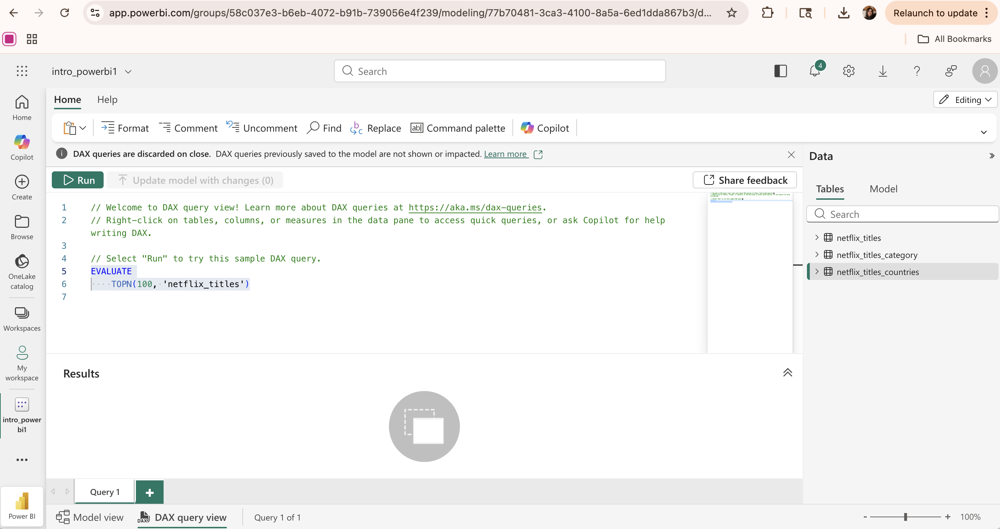
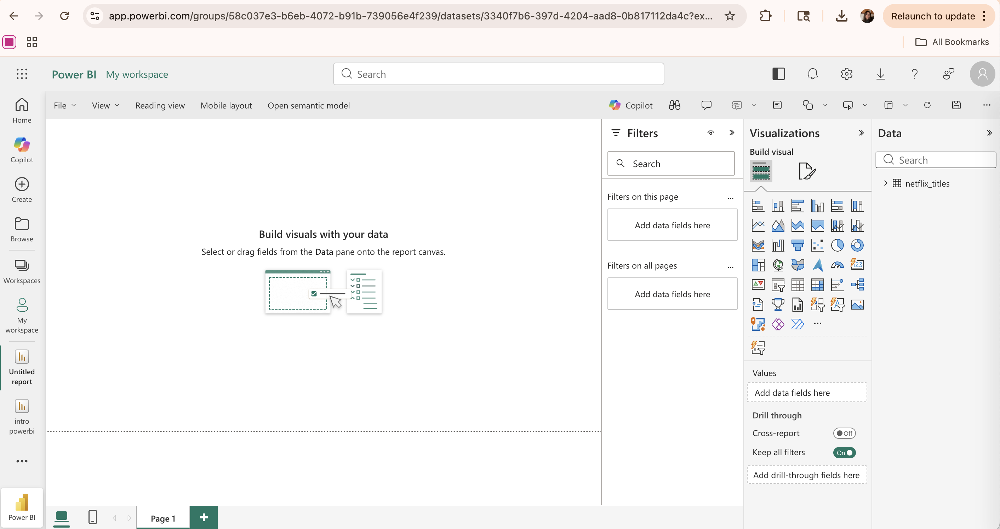
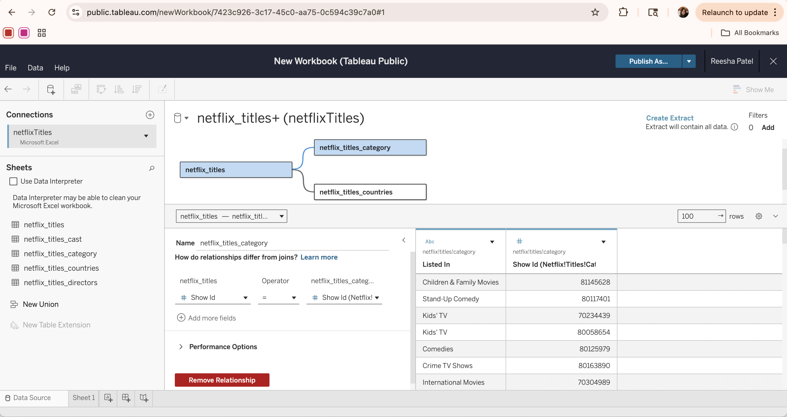
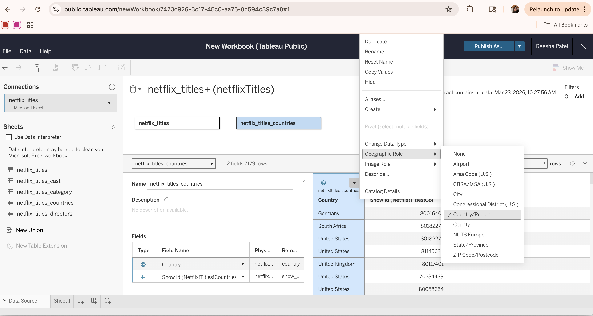
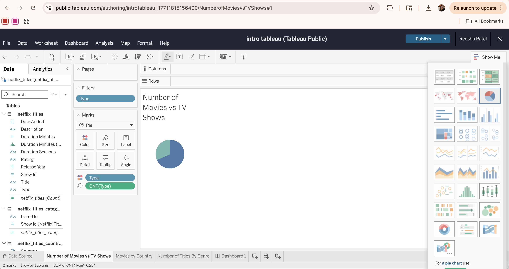

## Introduction to PowerBI and Tableau

This section was prepared by Reesha Patel.


### Introduction
Data visualization is an important data science tool for communicating complex relationships and conclusions in a more simple, comprehendable way. Transforming large datasets with numerous features into digestible visuals like charts or maps makes it easier to identify patterns and trends within the data. Further, data visualization plays a key role in exploratory data analysis (EDA) by just using visuals alone to investigate the data and answer overarching research questions.

Though python supplies various visualization packages, including `matplotlib` and `seaborn`, these tools often require advanced coding knowledge and can be time-consuming for creating complex, polished visuals. In contrast, tools like PowerBI and Tableau provide more functional and interactive displays for users to intuitively build visualizations using data.


### What is PowerBI?
- Visualization tool by Microsoft used for business intelligence and analysis.  

- Integrated with other Microsoft products (Excel, PowerPoint, Azure). 

- Connect data from a variety of sources, including from the cloud, databases, or Excel spreadsheets.

- Use Power Query for data filtering and transformations, like merging or joining tables.

- Use DAX (Data Analysis Expressions) for advanced data calculations.

- Integration with Python or R for more advanced analytics.

### What is Tableau?
- Data visualization tool used to create interactive dashboards for analysis or storytelling.

- Supports a wide variety of data files and can connect to databases (like SQL)

- No programming knowledge required.

- Utilizes the “Drag-and-Drop” method.

- Perfect for exploratory data analysis and visual storytelling.

- Provides free access to the software through Tableau Public

### PowerBI VS Tableau
PowerBI:  

- Commonly used for business reporting, KPI dashboards, and operational analytics.
- Use when already working with other Microsoft tools like Excel or PowerPoint.
- Provides structured data workflows for organizing and analyzing business data.

Tableau:  

- Designed for highly customizable and interactive visualizations.
- Best for advanced analytics, exploring complex datasets, and creating stories through visuals.
- Preferred in fields like research, consulting, and when needing flexibility in design.  


### PowerBI
To start creating visualizations in PowerBI, the first step is finding a dataset to explore. In this example, we will use the dataset [Netflix Movies and TV Shows](https://public.tableau.com/app/sample-data/netflix_titles.xlsx), which contains information about the titles and their countries, genres, release dates, etc. until 2019. Using this dataset, we will aim to answer three questions:  

1. What is the distribution of content types on Netflix? 

2. Which countries produce the most Netflix content? 

3. What are the most common genres on Netflix? 


#### Import Data
First, navigate to your Microsoft profile, open PowerBI, and click the “New Report” button.​ In this window, select the type of data source to import (e.g. Excel workbook, CSV file) or click "Get data" to see a wider variety of options. Then, load the data file (like .xlsx) to establish a connection between the source and the PowerBI workspace.​ At this point, the data tables are loaded in Power Query where they can be viewed, cleaned, and transformed before building visualizations.  

  


#### Examine, Clean, or Transform Data
Now, we can click each table to see its contents. This allows for general overview of the data to help identify any missing values, wrong data types, or other anomalies. Here, we can also select which tables we actually want to include in our report. In this example, will will choose `netflix_titles`, `netflix_titles_category`, and `netflix_titles_countries`.  

  


By selecting the tables we want to include, we can then use Power Query to perform any transformations by clicking the "Transform Data" button. Here, the data can be cleaned and transformed through filtering rows/columns, changing data types, or restructuring columns. This prepares the data for analysis without having to change the original file or go back after already creating initial visualizations.

In this case, we want to filter out the two rows with null/wrong `type` values in the `netflix_titles` table since this will hurt our visualization of the distribution of content types. In the initial examination of the data, there were two rows with incorrect values in the `type` column (`null` and `1944`). We want to filter these rows from the dataset. Additionally, in the `netflix_titles_countries` table, we want to make sure the data type for the `country` column is set to Country/Region. This way we can display titles by country on a spatial map.  

  


These transformations are applied within Power Query and are a part of Power BI’s semantic model, which defines how the data is structured and used for analysis. An important feature of the semantic model is that the transformations can be revisited, modified, or added at any time without affecting the original dataset. The semantic model also allows for relationships between tables to be created. In this example, we connect the tables through their shared `show_id` column.  


#### Using DAX
Another important feature of PowerBI is DAX, which is a language similar to Excel formulas used to create calculated columns, tables, measures, and other numerics for data analysis. DAX lets users define new relationships within the data and perform specific computations for unique visualizations. A major example of DAX, especially within the business application of PowerBI, is calculating profit based on Cost and Revenue columns: `Profit = SUM(Sales[Revenue]) - SUM(Sales[Cost])`  

  

 
#### Visualizations
Now, after the data has been preprocessed and structured, visualizations can be built to explore various relationships. The are a variety of different visuals available in PowerBI, including bar charts, line graphs, pie charts, matrices, KPIs, interactive maps, etc. Each visualization has customizable aspects, ranging from basic formatting changes like titles or axis names to more complex changes like filters or adding advanced analytics. 


The visualization page automatically creates an empty dashboard where you can add multiple visualizations on one page. Multiple pages can be created for various different dashboards. This page also consists of a "Data" tab, where the data tables are populated, and a "Visualizations" tab, where all the different options are available.  

  


To create a visualization, start by clicking a specific type of visualization from the tab. Now, various field options appear below where columns can be dragged and dropped to define a relationship. 


For example, to create a pie chart for the type of content, we can drag the `type` column from the `netflix_titles` table into the **Legend** field, which separates the categories into *Movie* or *TV Show*. The same column can also be dragged into the **Values** field, where it is automatically aggregated as a count. This creates a pie chart divided into two sections based on the number of titles that fall into each `type` category. 

This same drag-and-drop approach can be used to create other visualizations, allowing different relationships within the data to be explored.  


##### Final Dashboard
After creating visualizations based on our three guiding questions, we can now gain insights by examining the whole dashboard. The visualizations reveal patterns in the distribution of content types, highlight which countries contribute the most content, and show the most common genres on Netflix up until 2019. Together, these insights provide a clearer understanding of the dataset and show how visualizations can be effectively used to explore and communicate data.

<iframe title="intro_powerbi_final" width="800" height="500" src="https://app.powerbi.com/view?r=eyJrIjoiNTk0M2IzYmQtOGQ0Ni00ZWQ1LWFhODktZDJkYjBmNjY3NGIzIiwidCI6IjE3ZjFhODdlLTJhMjUtNGVhYS1iOWRmLTlkNDM5MDM0YjA4MCIsImMiOjF9" frameborder="0" allowFullScreen="true"></iframe>


### Tableau
To start creating visualizations in Tableau, the first step is also to find a dataset to explore. We will use the same dataset [Netflix Movies and TV Shows](https://public.tableau.com/app/sample-data/netflix_titles.xlsx) and aim to answer the same three questions, now with a different visualization tool:  

1. What is the distribution of content types on Netflix? 

2. Which countries produce the most Netflix content? 

3. What are the most common genres on Netflix? 


#### Import Data
First, navigate to your Tableau profile (this example uses Tableau Public, which is the free online version of the Tableau software) and click the "Create Viz" button. In the popup window, select the data source by either uploading a file or connecting to an external source (e.g. Google Drive). Once loaded, the data appears in the **Data Source** tab, where tables can be viewed, inspected, and joined if necessary.

The **Data Source** tab allows for different tables to be connected together by creating a relationship based on a common column (the `show_id` column in this case). Once all the data tables of interest are added to the page, click *Create extract* to load the data into Tableau’s in-memory engine for improved performance and faster analysis.  

  


#### Examine or Transform Data
Additionally, in the **Data Source** tab, the tables can be examined to better understand their structures. Here, data cleaning and basic transformations can also be performed, like renaming fields, changing data types, or adjusting table connections. This helps prepare the data for easier visualization.

For example, to visualize titles by country on a map, the `country` column in the `netflix_titles_countries` table must be assigned a geographic role. By changing its data type to Country/Region, Tableau recognizes the values as geographic data and can automatically generate map-based visualizations.  

  


#### Visualizations
Once the data has been processed and extracted, it is ready for visualization. To start creating a visualization, first create a new empty sheet. In Tableau, each visualization is created on a separate sheet, which can later be combined into a dashboard. 

Each sheet consists of three main components. First is the Data and Analytics panel, where the data tables and their fields are populated and can be selected for use in visualizations. The analytics tab provides additional options for further analysis, including trend lines, reference lines, and summaries.

The second component deals with customization of the appearance of the visualization. Here, various aspects of the visuals can be changed, including colors/graphics, size, labels, filters, marks, and other general formatting options.

Finally, the main blank canvas is where the visualization is displayed and updated as data is added. To build a visualization:  

1. Drag data columns into view fields based on a relationship structure.  
2. Select or adjust the visualization type using the *Marks* dropdown menu.  
3. (Optionally) Click the **Show Me** button in the top-right corner and select the type of visualization.  

For example, to create a pie chart for the distribution of content types, we can drag the `Type` column from the `netflix_titles` table into the *Marks* field. Then, drag the same `Type` column again, but change it to a count measure using the drop-down arrow. Then, we can change the *Marks* type to "Pie", set the `Type` column as the color legend, and set the CNT(Type) as a "slice" or angle of the pie.

Optionally, another way to create this same visualization is through the **Show Me** tab. We can drag the `Type` column from the `netflix_titles` table into the *Columns* field. Then, drag the same `Type` column into the *Rows* field, but change it to a count measure using the drop-down arrow. Select the Pie Chart visualization from the **Show Me** tab to visualize the distribution of content types.

Lastly, we can edit the visualization in the *Marks* section. First, we can change the color of each pie section to follow a consistent format. We can also add a filter to the `type` column so we exclude the inconsistent/null values in the data set, and only show titles with a content type of *Movie* or *TV Show*. Adding filters helps refine the data and create clearer, more focused visualizations.  


  


##### Final Dashboard
Once all visualizations are created independently, a new dashboard can be created to combine and summarize the results. Each individual visualization can be dragged onto the dashboard and arranged to create a comprehensive and clear layout.

This dashboard provides an overview of the data, allowing for multiple relationships to be analyzed at once and for dynamic visualization through filters and selections. This makes it easier to identify overall patterns and draw conclusions from the dataset.

<iframe src="https://public.tableau.com/views/introtableau_17711815156400/Dashboard1?:language=en-US&:sid=&:redirect=auth&:display_count=n&:origin=viz_share_link?:showVizHome=no&:embed=true" 
        height="800" width="1000" frameborder="0" allowFullScreen="true"></iframe>


#### Storylines
One final aspect of Tableau is its [Story](https://help.tableau.com/current/pro/desktop/en-us/story_create.htm) feature, which allows for data to be presented through a sequence of visualizations. Each story contains multiple "story points," with each point displaying a certain graphic along with some descriptive caption. 

This feature is especially helpful for presentations, especially when guiding a non-technical audience through the data analysis process. Rather than showing all the visualizations at once, a story follows a narrative and highlights key graphics or conclusions along the way. For example, it could start with an overview of the data, then move into each research question and the specific visualization to explain/support it.

Overall, structuring visualizations through storytelling helps communicate the results of data exploration more effectively.  


### Integration With Python
An advantage of both PowerBI and Tableau is their ability to integrate python for extended capabilities, specifically for preprocessing data or for more advanced analytics. Though the tools provide a strong interface for building visualizations, python allows for more flexible data manipulation, complex computations, dataset merging, statistical modeling, and machine learning, which can all be integrated into the dynamic visualizations. Combining python with these tools helps easily create more accurate and meaningful visualization and data workflows.  


#### Preprocess Using Python
This method involves importing and preprocessing the dataset using python first, and then uploading the new, cleaned dataset into either visualization platform. For users who are more comfortable with programming, this approach might be more flexible than cleaning the data in PowerBI or Tableau.

Preprocessing in python can include tasks like examining the dataset, handling missing values or null rows, or creating new columns through calculations. For example, we can import the dataset and check for missing or incorrect values in the `type` column:
```{python}
import pandas as pd

# load the dataset
df = pd.read_excel("./powerbi_tableau_files/netflix_titles.xlsx")

# check for incorrect/null values - not Movie or TV Show
incorrect = df[~df['type'].isin(['Movie', 'TV Show'])]
print("number of incorrect rows: ", incorrect.shape[0])
```


From here, we can further examine the rows with incorrect values and determine to drop them from the dataset:  
```{python}
# print out the incorrect rows
print(incorrect)

# remove invalid rows
df = df[df['type'].isin(['Movie', 'TV Show'])]
```

Lastly, we can now export our cleaned data as a CSV file:  
```{python}
df.to_csv("./powerbi_tableau_files/netflix_titles_cleaned.csv", index=False)
```

The cleaned dataset can then be loaded into Power BI or Tableau for visualization.   


#### Running Python in PowerBI
Running python in PowerBI requires a local python setup. Currently, python can only be integrated on Windows (PowerBI Desktop) where the python scripting option must be enabled. There are three main ways to use python in PowerBi:  


- **Import Data with a Python Script**  
  + Use python scripts to create dataframes or load data from APIs/external sources
  + Script must return a Pandas DataFrame
  + During the data import process, click "Get Data," set the source to "Python script," and then type/paste your code  

- **Transform Data in Power Query**  
  + Use python scripts for advanced data cleaning or analysis
  + Uses an existing dataset as variable input
  + When examining the data tables after import, click "Transform Data" and then "Run Python Script"  

- **Create Custom Visuals**  
  + Use python libraries like matplotlib or seaborn to program visuals
  + Note: these visualizations are static (non-interactive and will not update with data changes) 
  + In the visualization tab, select the python visual icon to enable it and use plt.show() to display the visual


#### TabPy
To integrate python with Tableau, a package called TabPy (Tableau Python Server) can be used. TabPy lets Tableau remotely execute python code and return results as calculated values within the visuals.

To set up TabPy in Tableau:   

1. Install `tabpy` in terminal.
2. Set up a connection in Tableau using a local host server.
3. Test the connection to make sure the link is active.

Once connected, python can be used within Tableau to perform advanced calculations and analytics.

Some common uses of TabPy include:  

**Calculated Fields**  
Tableau provides built-in SCRIPT functions that allow python code to be executed within a workbook:  

- `SCRIPT_REAL` will return numeric values
- `SCRIPT_STR` will return string values
- `SCRIPT_INT` will return integers
- `SCRIPT_BOOL` will return booleans

For example: `SCRIPT_REAL("return [x * 2 for x in _arg1]", SUM([Sales]))`. This line will use the input values from the SUM([Sales]) field, multiply each value by 2, and then return the result as a numeric output. This creates a calculated field used only within the visualization (it will not modify the original dataset or create a new column).  

**Tableau Prep Builder**  
Python can also be for data preparation by adding a Script step in Tableau Prep. This requires a script file (.py) that takes a Pandas DataFrame as input and will then return a transformed DataFrame.


### Conclusion
- Data visualization is a useful tool for investigating complex datasets and discovering patterns or trends within the data.
- Both PowerBI and Tableau provide interactive platforms for creating dynamic visualizations without requiring advanced coding knowledge.
- PowerBI is more commonly used for business analytics and reporting, especially within the Microsoft ecosystem. Tableau pertains more to data exploration, customization, and visual storytelling.
- Integrating python with data visualization tools allows for more advanced data preprocessing and analytics outside of the built-in features.  


### Further Readings

- [Power BI Tutorial for Beginners](https://www.datacamp.com/tutorial/tutorial-power-bi-for-beginners)

- [Introduction to Tableau](https://www.geeksforgeeks.org/tableau/introduction-to-tableau/) 

- [Run Python scripts in Power BI Desktop](https://learn.microsoft.com/en-us/power-bi/connect-data/desktop-python-scripts)

- [TabPy](https://github.com/tableau/tabpy?tab=readme-ov-file)
